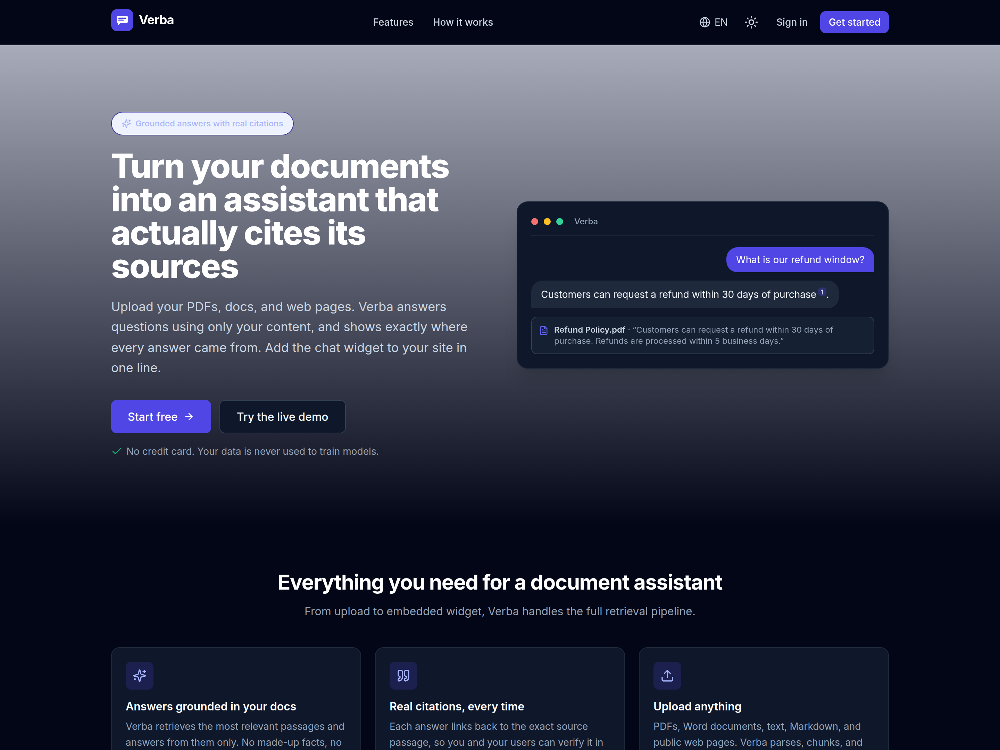
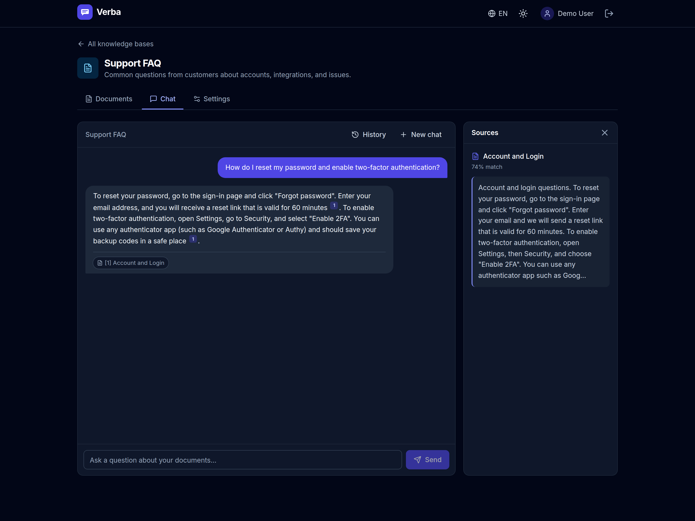
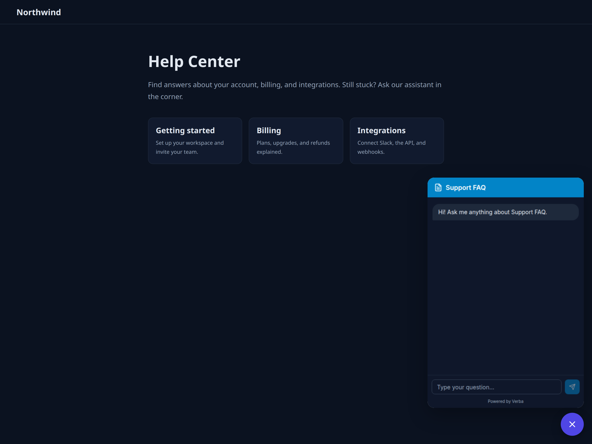

# Verba

Verba is a full-stack "chat with your documents" assistant. Upload PDFs, Word files,
text, Markdown, or web pages, and Verba answers questions using only your content, with
real citations back to the exact source passage. It includes an embeddable chat widget
you can drop on any website in one line.

Available in English, Spanish, and Portuguese.

## Screenshots



Grounded answers with real citations and a source panel:



The embeddable website widget, live on any site:



## How it works

1. **Ingest** - documents are parsed, split into overlapping passages, and embedded into a
   vector index.
2. **Retrieve** - each question is embedded and matched against the passages by meaning.
3. **Answer** - the model responds using only the retrieved passages and cites each one. If
   the answer is not in your documents, Verba says so instead of guessing.

## Features

- Retrieval-augmented answers grounded in your own documents
- Real citations linked to the source passage, with a similarity score
- Upload PDF, DOCX, TXT, Markdown, a web URL, or pasted text
- Embeddable website chat widget with a public token
- Multiple knowledge bases per account, each with its own widget
- Tunable retrieval (passages per answer, minimum relevance)
- Daily usage limits to protect the shared quota
- Light and dark themes, fully responsive
- Trilingual UI and answers (EN / ES / PT)

## Stack

| Layer      | Technology |
|------------|------------|
| Frontend   | Next.js (App Router), TypeScript, Tailwind CSS, next-intl |
| Backend    | Express, TypeScript, Prisma |
| Database   | PostgreSQL with the pgvector extension |
| Embeddings | Gemini `gemini-embedding-001` (768 dims), behind a provider interface |
| Generation | Groq `llama-3.3-70b-versatile` (Gemini and Claude also supported, one env var to switch) |
| Hosting    | Vercel (frontend and backend), Neon Postgres |

The browser only talks to the frontend origin; `/api/*` is proxied to the backend, so the
backend URL and the model key are never exposed to the client.

## Local development

```bash
# Backend
cd backend
cp .env.example .env      # set DATABASE_URL (Neon), JWT secrets, GEMINI_API_KEY
npm install
npm run prisma:push       # creates tables + pgvector extension + vector index
npm run seed              # loads demo knowledge bases
npm run dev

# Frontend (in a second terminal)
cd frontend
cp .env.example .env.local
npm install
npm run dev
```

Then open http://localhost:3000 and use the one-click demo login.
